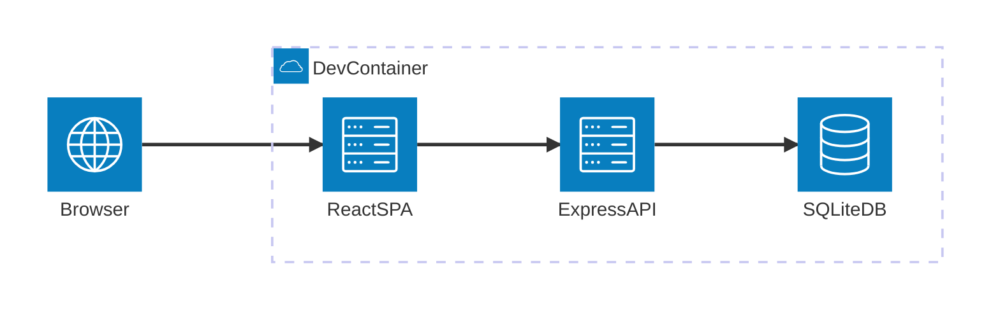
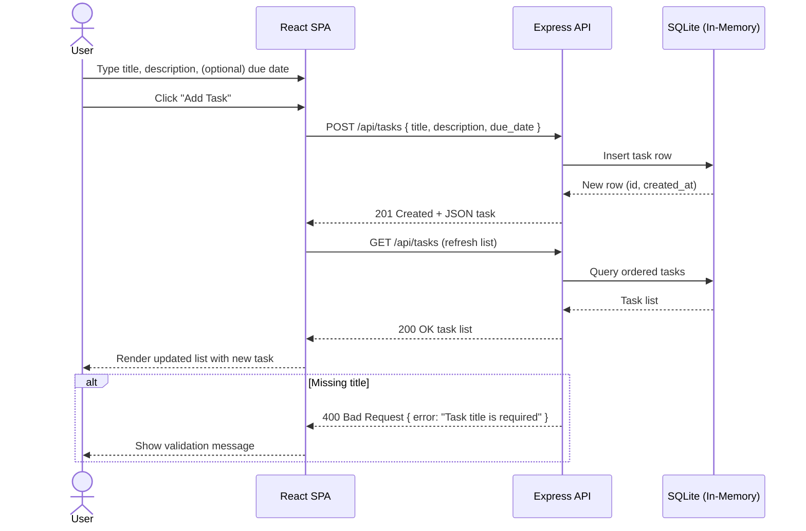

# Cloud / System Architecture Overview

This document provides a high-level system context for the TODO App monorepo. The environment is a development container hosting both the React frontend and Express backend. Persistence is currently an in-memory SQLite database (ephemeral) within the backend process.

## Context Summary
- User interacts via a browser with the React SPA (`packages/frontend`).
- Frontend communicates over HTTP with the Express API (`/api/tasks`) served by `packages/backend`.
- The API uses an in-memory SQLite database for task storage (no external persistence layer yet).
- All components run inside a single dev container / monorepo workspace (no separate cloud services provisioned).

## System Context Diagram

## Notes
- Arrows show request flow direction (left to right).
- In-Memory SQLite is transient; restarting the backend clears data.
- Future evolution may introduce: external persistence (PostgreSQL), auth service, and CDN for static assets.

## Potential Extensions
- Add group for "External Services" when introducing third-party APIs or persistent storage.
- Introduce junctions if fan-out (e.g., API calling multiple microservices) is added.

## Sequence: User Creates a TODO

The following sequence diagram shows the interaction flow when a user creates a new task.

---
_Last updated: 2025-11-04_
